# HY-World 1.5: A Systematic Framework for Interactive World Modeling with Real-Time Latency and Geometric Consistency

Tencent Hunyuan*

https://3d.hunyuan.tencent.com/sceneTo3D

https://github.com/Tencent-Hunyuan/HY-WorldPlay

# Abstract

While HunyuanWorld 1.0 is capable of generating immersive and traversable 3D worlds, it relies on a lengthy offline generation process and lacks real-time interaction. HY-World 1.5 bridges this gap with WorldPlay, a streaming video diffusion model that enables real-time, interactive world modeling with long-term geometric consistency, resolving the trade-off between speed and memory that limits current methods. Our model draws power from four key designs. 1) We use a Dual Action Representation to enable robust action control in response to the user’s keyboard and mouse inputs. 2) To enforce long-term consistency, our Reconstituted Context Memory dynamically rebuilds context from past frames and uses temporal reframing to keep geometrically important but long-past frames accessible, effectively alleviating memory attenuation. 3) We design WorldCompass, a novel Reinforcement Learning (RL) post-training framework designed to directly improve the action-following and visual quality of the long-horizon, autoregressive video model. 4) We also propose Context Forcing, a novel distillation method designed for memory-aware models. Aligning memory context between the teacher and student preserves the student’s capacity to use long-range information, enabling real-time speeds while preventing error drift. Taken together, HY-World 1.5 generates long-horizon streaming video at 24 FPS with superior consistency, comparing favorably with existing techniques. Our model shows strong generalization across diverse scenes, supporting first-person and third-person perspectives in both real-world and stylized environments, enabling versatile applications such as 3D reconstruction, promptable events, and infinite world extension.

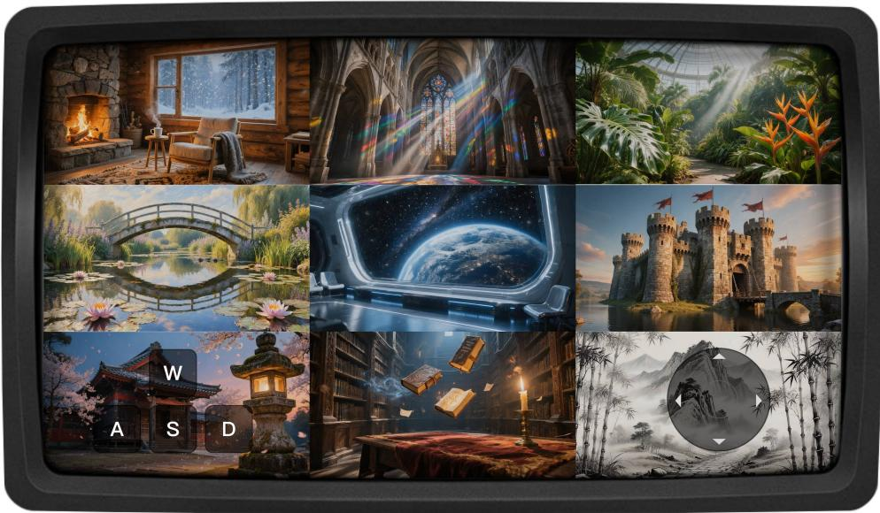

# Contents

1 Introduction 3   
2 Data 5

2.1 Data Curation 5   
2.2 Data Filter and Enhancement 5   
2.3 Metadata Annotation 6

3 Model Pre-Training: Autoregressive Generative Model 6

3.1 Bidirectional Diffusion Model 6   
3.2 Chunk-wise Autoregressive Generation 7

4 Model Middle-Training: Control and Memory Integration 8

4.1 Dual Action Representation . 8   
4.2 Reconstituted Context Memory for Consistency 8

5 Model Post-Training I: Efficient Reinforcement Learning 9

5.1 Challenges of Reinforcement Learning for World Models 9   
5.2 WorldCompass Framework Design 9

6 Model Post-Training II: Context Forcing Distillation 9

6.1 The Distribution Matching Challenge 10   
6.2 Context Forcing 10

7 Model Inference: Play with the World 11

7.1 Acceleration and Engineering Optimization 11   
7.2 Go Beyond Action Control: Text-Based Event Triggering . 12

8 Model Evaluation 12

8.1 Main Results 12   
8.2 Applications and More Results 15

9 Conclusion 16

Contributors 18

# 1 Introduction

“Hold Infinity in the Palm of Your Hand, and Eternity in an Hour”

— William Blake

World models are driving a pivotal shift in computational intelligence, moving beyond languagecentric tasks towards visual and spatial reasoning. By simulating dynamic 3D environments, these models empower agents to perceive and interact with complex surroundings, opening up new possibilities for embodied robotics and game development. While HunyuanWorld 1.0 [9] is capable of generating immersive 3D worlds, it relies on a lengthy offline generation process and lacks the capacity for real-time interaction.

At the forefront is real-time interactive world modeling, which aims at autoregressively predicting future frames to deliver instant visual feedback in response to every user’s keyboard commands. Despite significant progress, a fundamental challenge persists: how to simultaneously achieve realtime generation (speed) and long-term geometric consistency (memory) in interactive world modeling. One class of methods [4, 20, 6] prioritizes speed with distillation but neglects memory, resulting in inconsistency where scenes change upon revisit. The other class preserves consistency with explicit [14, 22] or implicit [29, 32] memory, but complex memory makes distillation non-trivial. As summarized in Tab. 1, the simultaneous achievement of both low latency and high consistency remains an open problem.

In HY-World 1.5, we develop WorldPlay [24], a real-time and long-term consistent world model for general scenes. We consider this problem as a next chunk (16 frames) prediction task for generating streaming videos conditioned on action from users. Building upon autoregressive diffusion models, WorldPlay draws power from the model’s four key ingredients below.

The first is Dual Action Representation [24] for control over agent and camera movement. Previous works [4, 20, 6] typically rely on discrete keyboard inputs (e.g., W, A, S, D) as action signals, which afford plausible, scale-adaptive movement but suffer from ambiguity for memory retrieval that requires revisiting exact locations. Conversely, continuous camera poses $( R , T )$ provide spatial locations but cause training instability due to scene scale variance in training data. To combine the best of both worlds, we convert action signals into discrete keys and continuous camera poses, achieving robust control and accurate location caching.

The second key design is Reconstituted Context Memory [24] for maintaining long-term geometric consistency. We actively reconstitute the memory through a two-stage process, moving beyond simple retrieval [32, 29]. It first dynamically reconstitutes memory context by querying past frames based on spatial and temporal proximity. To overcome the long-range decay (the fading influence of distant tokens in Transformers [23]), we further propose temporal reframing to rewrite positional embeddings of these retrieved frames. This operation effectively “pulls" geometrically important but long-past memories closer in time, forcing the model to treat them as recent. This process keeps the influence of relevant long-range information preserved, enabling robust free extrapolation with strong geometric consistency.

The third key contribution is WorldCompass RL Framework [27], designed to further improve complex action following accuracy and visual quality. While RL is recognized as a promising approach for explicitly and purposefully improving a model’s capabilities, its application to world modeling poses unique challenges due to the inherent long-horizon, autoregressive, and interactive nature of world modeling. We therefore propose the WorldCompass framework, which uses reward functions to "steer" the model’s exploratory behavior. This framework includes a novel clip-level rollout strategy to mitigate exposure bias and enhance efficiency, and complementary reward functions to suppress reward hacking. This RL stage provides the essential explicit training signal, which significantly enhances our model’s performance under various challenging scenarios.

The final key ingredient is Context Forcing [24], a novel distillation method designed for memoryaware models to enable real-time generation. Existing distillation methods [2, 8, 31] fail to keep long-term memory as there is a fundamental distribution mismatch: training a memory-aware autoregressive student to mimic a memory-less bidirectional teacher. Even when augmenting teacher with memory, mismatched memory context will cause distribution diverge. We solve this by aligning the memory context for teacher and student during distillation. This alignment facilitates effective

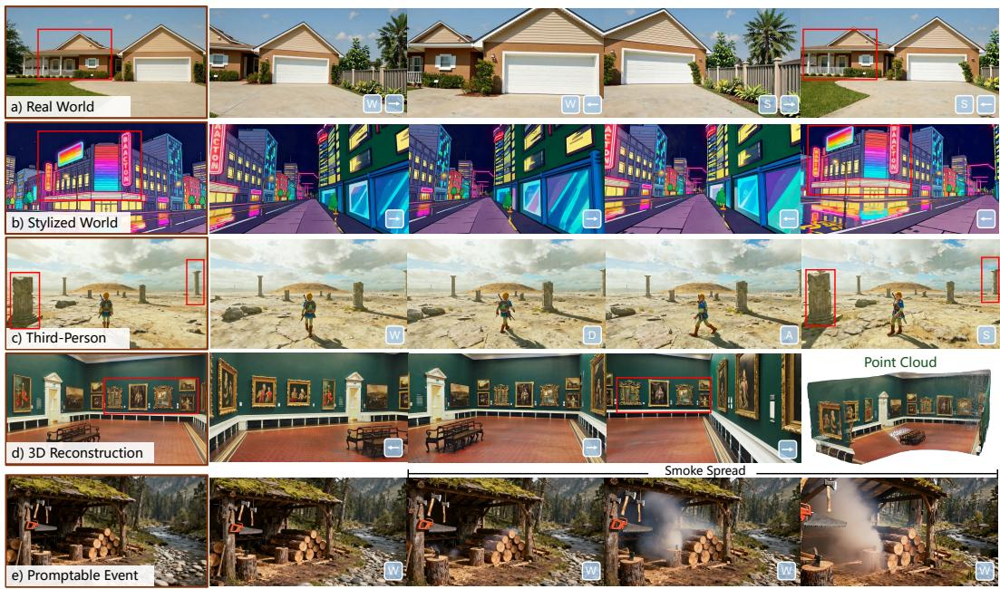  
Figure 1: WorldPlay is a real-time, interactive world model that achieves long-term geometric consistency. It responds to user navigation commands in a streaming fashion and maintains scene coherence when revisiting (shown in red boxes). Our model shows remarkable generalization across diverse scenes, including (a) real world, (b) stylized world, and (c) third-person agent scenarios. Furthermore, it supports (d) 3D scene generation via reconstruction and (e) promptable event triggered by text-based manipulation.

distribution matching, enabling real-time speed without eroding the memory while alleviating error accumulation over long sequences.

Taken together, we achieve interactive world generation at 24 FPS while maintaining long-term geometric consistency. The model is built on a curated dataset of 320K videos with a custom rendering and processing platform. As shown in Fig. 1, our model shows superior generation quality and remarkable generalization across diverse scenes, including first- and third-person real and stylized worlds, and supports applications ranging from 3D reconstruction and promptable events.

Table 1: Comparison with recent interactive world models.   
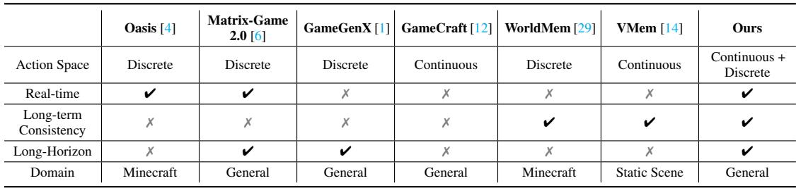

Report Organization. This technical report is organized as follows: Sec. 2 describes our data processing pipeline. Sec. 3 introduces the pre-training stage for constructing an autoregressive generative model. Sec. 4 introduces our dual action representation and reconstituted context memory for action control and long-term consistency. Sec. 5 covers our reinforcement learning post-training, which leverages 3D feedback and visual feedback to further enhance the model. Sec. 6 details the context forcing post-training, which achieves real-time latency and mitigates exposure bias while preserving long-term consistency. Sec. 7 covers the engineering and deployment optimization for real-time streaming inference. Sec. 8 presents comprehensive experimental results and ablation studies. Fig. 2 provides an overview of HY-World 1.5.

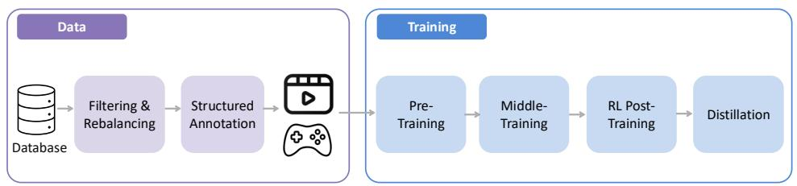

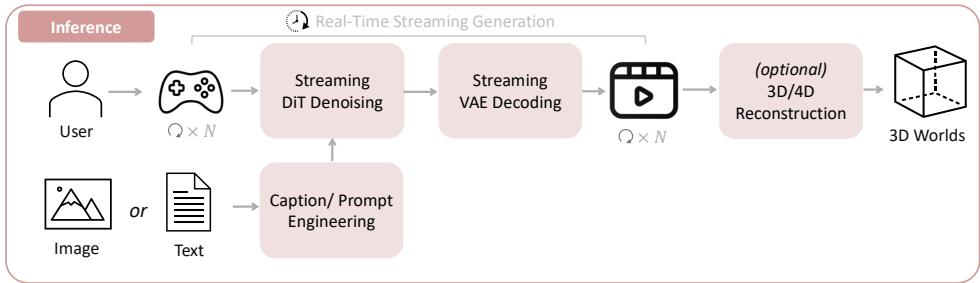  
Figure 2: Overview of HY-World 1.5.

# 2 Data

HY-World 1.5 relies on a comprehensive training dataset, comprising 320K curated video clips, with consideration for data diversity, quality, and annotation accuracy. Fig. 3 illustrates the overview of our data system.

# 2.1 Data Curation

Our training dataset is strategically composed of four distinct categories, each addressing different aspects of interactive world modeling while contributing to the overall diversity and comprehensiveness of the training corpus. The largest component, comprising 170K clips $( 5 3 . 1 2 5 \% )$ , consists of recordings of AAA games captured from both first-person and third-person perspectives. These video clips offer rich, interactive scenarios featuring complex agent behaviors, physics simulations, and diverse environmental interactions.

Real-world 3D contains 60K clips $( 1 8 . 7 5 \% )$ and is derived from the DL3DV dataset [16], providing realistic appearances and accurate scene structures. Specifically, we first perform 3D reconstruction [10] for each original video. Then, we carefully design camera trajectories to simulate interactive navigation patterns, ensuring comprehensive coverage of different movements and rotations that are essential for developing robust action control.

Synthetic 4D comprises 50K clips $( 1 5 . 6 2 5 \% )$ rendered using Unreal Engine. This synthetic data provides dynamic object interactions and controllable lighting, further enriching the diversity of our dataset. Furthermore, it offers precise ground truth annotations, which are often difficult to obtain in real-world data and are particularly valuable for learning action patterns.

The final category, sourced from the Sekai dataset [15], includes 40K clips $( 1 2 . 5 \% )$ focusing on natural, real-world videos with dynamic motion and interactions. We applied rigorous filtering criteria to ensure high visual quality, stable camera movements, and meaningful interactive elements. These clips provide essential priors for realistic motion patterns and object behaviors that occur in natural environments, grounding our model’s capabilities in real-world environments.

# 2.2 Data Filter and Enhancement

The raw data from these diverse sources undergoes a sophisticated multi-stage data filtering pipeline designed to ensure visual quality and motion consistency. We first implement an automated visual quality assessment system using tools such as video aesthetics scoring, watermark and UI detection, and compression artifact detection, where video clips that fail to meet minimum quality requirements are filtered out.

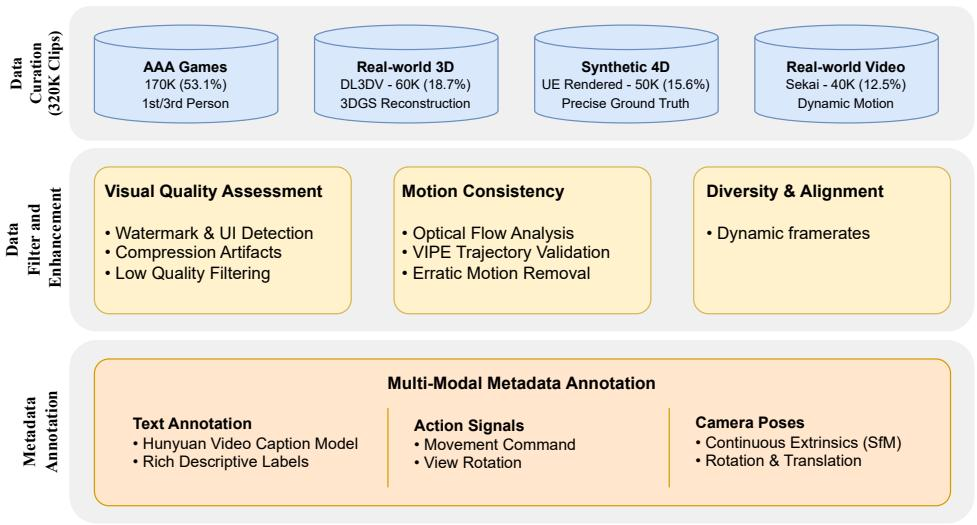  
Figure 3: Data overview.

Motion consistency analysis is another crucial component that ensures the dataset exhibits physically realistic movement behaviors, which is essential for developing stable interactive responses. Specifically, we first analyze the motion intensity using optical flow to filter out video clips with severe camera shake. Then, we validate the smoothness and plausibility of camera trajectories for each video clip, filtering out abrupt or impossible camera movements that could negatively impact training. This systematic filtering pipeline ensures data quality and promotes faster model convergence.

We further enhance the content quality and diversity of the training dataset. Specifically, we boost diversity by leveraging dynamic frame rates, thereby ensuring comprehensive coverage across scenarios involving various playback speeds, camera motions, and frame rate configurations.

# 2.3 Metadata Annotation

The metadata annotation process transforms video clips into training samples with rich annotations. We leverage the caption model from HunyuanVideo 1.5 [25] to produce structural text annotations for each video clip. Continuous camera poses are estimated using VIPE [7] or directly extracted from Unreal Engine and the 3D rendering pipeline. Discrete action signals are then derived from these camera trajectories, categorizing actions into movement commands and view rotations. For recordings from AAA games, discrete action signals are directly recorded.

# 3 Model Pre-Training: Autoregressive Generative Model

# 3.1 Bidirectional Diffusion Model

Current bidirectional video diffusion models [25, 26], through training on web-scale datasets, have acquired the ability to perceive, model, and manipulate the real world, enabling them to generate realistic videos. They typically employ a 3D variational autoencoder (VAE) [11] that compresses videos into a compact latent space. Subsequently, Diffusion Transformer (DiT) [21] is used for generative modeling in this latent space. Each DiT block consists of 3D self-attention, cross-attention for conditional inputs [26] (or dual-stream attention [25]), and feed-forward networks. These models $N _ { \theta }$ parameterized by $\theta$ are trained using the flow matching objective [17], which is formulated as:

$$
\mathcal {L} _ {\mathrm {F M}} (\theta) = \mathbb {E} _ {k, z _ {0}, z _ {1}} \left\| N _ {\theta} \left(z _ {k}, k\right) - v _ {k} \right\| ^ {2}, \tag {1}
$$

where $z _ { 0 }$ represents the video latent encoded by the 3D VAE, $z _ { 1 } \sim \mathcal { N } ( 0 , I )$ denotes the Gaussian noise, $z _ { k }$ represents the noisy latent at diffusion timestep $k$ , and $v _ { k }$ is the target velocity.

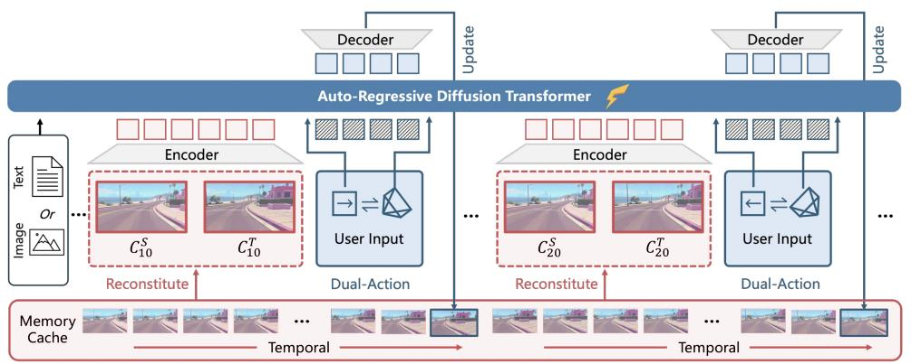  
Figure 4: WorldPlay Architecture. Given a single image or text prompt to describe a world, our model performs a next chunk (16 video frames) prediction task to generate future videos conditioned on action from users. For the generation of each chunk, we dynamically reconstitute context memory from past chunks to enforce long-term temporal and geometric consistency.

# 3.2 Chunk-wise Autoregressive Generation

The bidirectional video diffusion model is a non-causal architecture, which limits its ability for infinitelength interactive generation. However, the goal for WorldPlay is to construct a real-time interactive world model with long-term geometric consistency detailed as $N _ { \theta } ( x _ { t } | O _ { t - 1 } , A _ { t - 1 } , a _ { t } , c )$ , which can generate next chunk $x _ { t }$ (a chunk is 16 frames) based on past observations $O _ { t - 1 } = \{ x _ { t - 1 } , . . . , x _ { 0 } \}$ , action sequences $A _ { t - 1 } = \{ a _ { t - 1 } , . . . , a _ { 0 } \}$ , and current action $a _ { t }$ . Here, $c$ is a text prompt or image that describes the world. For simplicity of notation, we omit $A , a , c$ in the following sections.

To enable real-time interactive long-horizon generation, we convert the bidirectional video model to a chunk-wise autoregressive generative model. We divide video sequences into chunks of 4 latents, corresponding to 16 frames. Inspired by Diffusion Forcing [2], during training, we add different noise levels for each chunk and modify bidirectional self-attention to block causal attention. The training loss is similar to Eq. 1. This trained autoregressive model establishes the foundational capabilities needed for interactive world modeling, serving as the base for subsequent action and memory integration.

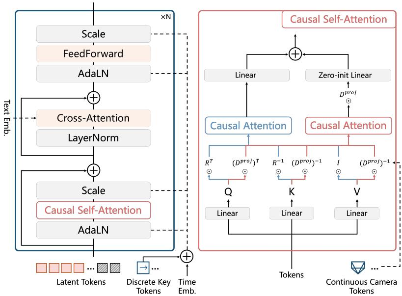  
Figure 5: Our DiT architecture. We use the dual action representation, including discrete and continuous control signals, to enable precise action control.

# 4 Model Middle-Training: Control and Memory Integration

This middle-training stage integrates action control and memory mechanisms into the autoregressive generative model to achieve accurate action control and long-term geometric consistency. We first introduce a dual-action representation for action control, followed by our reconstituted context memory, which maintains consistency when revisiting previously seen areas.

# 4.1 Dual Action Representation

Using only discrete action signals [4, 29, 6, 32] enables learning physically plausible movements across scenes with diverse scales (e.g., extremely large and small scenes). However, they struggle to provide precise previous locations for spatial memory retrieval. In contrast, continuous camera poses (rotation and translation matrix) provide accurate spatial locations that facilitate precise control and memory retrieval. However, training only with camera poses faces challenges in training stability due to the scale variance in the training data. As shown in Fig. 5, we introduce a dual action representation that combines the best of both discrete and continuous control signals.

For discrete actions (keyboard and mouse inputs), we employ a zero-initialized MLP to project the action embedding and incorporate it into the timestep embedding, which is used to modulate the DiT blocks. For continuous camera poses, we leverage Projective Positional Encoding (PRoPE) [13] to inject camera pose information into self-attention blocks. The original self-attention computation is as follows:

$$
A t t n _ {1} = A t t n \left(R ^ {\top} \odot Q, R ^ {- 1} \odot K, V\right), \tag {2}
$$

where $R$ represents the 3D rotary PE (RoPE) [23] for video latents and $\odot$ denotes the matrix-vector product [13]. To encode frustum relationships between cameras, we utilize an additional attention computation,

$$
A t t n _ {2} = D ^ {p r o j} \odot A t t n \left(\left(D ^ {p r o j}\right) ^ {\top} \odot Q, \left(D ^ {p r o j}\right) ^ {- 1} \odot K, \left(D ^ {p r o j}\right) ^ {- 1} \odot V\right), \tag {3}
$$

here, $D ^ { p r o j }$ is derived from the camera’s intrinsic and extrinsic parameters, as described in [13]. Finally, the outcome of each self-attention block is added via the zero-initialization layer as $A t t n _ { 1 } +$ zero_init(Attn2). This dual action representation enables both robust control across diverse scene scales and precise spatial localization for memory retrieval.

# 4.2 Reconstituted Context Memory for Consistency

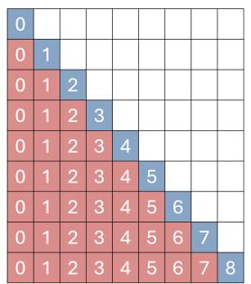  
(a) Full context

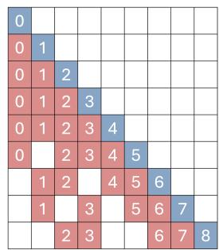  
(b) Absolute indices

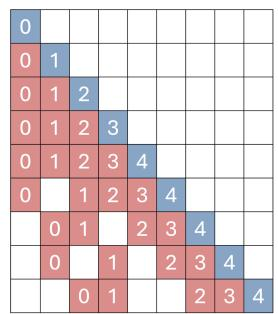  
(c) Relative indices   
Figure 6: Memory mechanism comparisons. The red and blue blocks represent the memory and current predicted chunk, respectively. The number in each block represents the temporal index in RoPE. For simplicity of illustration, each chunk only contains one frame.

Maintaining long-term geometric consistency requires recalling past chunks, ensuring content remains unchanged when revisiting a previous location. However, naively using all past chunks as context (Fig. 6a) is computationally intractable and redundant for long sequences. To address this, we rebuild a memory context $C _ { t }$ from past chunks $O _ { t - 1 }$ for each new chunk $x _ { t }$ . Our approach advances beyond prior work [29, 32] by combining both short-term temporal cues and long-range spatial references: 1) A temporal memory $( C _ { t } ^ { T } )$ comprises $L$ most recent chunks $\{ x _ { t - L } , . . . , x _ { t - 1 } \}$ to ensure short-term motion smoothness. 2) A spatial memory $( C _ { t } ^ { S }$ ) samples from non-adjacent past frames to prevent

geometric drift over long sequences, where $C _ { t } ^ { S } \subseteq O _ { t - 1 } - C _ { t } ^ { T } .$ . This sampling is guided by geometric relevance scores that incorporate both FOV overlap and camera distance.

Once memory context is rebuilt, the challenge shifts to applying them to enforce consistency. Effectively using retrieved context requires overcoming a fundamental flaw in positional encodings. With standard RoPE (Fig.6b), the distance between the current chunk and past memory grows unbounded over time. This growing relative distance can eventually exceed the trained interpolation range in RoPE, causing extrapolation artifacts [23]. More critically, the growing perceived distance to these long-past spatial memory would weaken their influence on the current prediction. To resolve this, we propose Temporal Reframing (Fig.6c). We discard the absolute temporal indices, and dynamically re-assign new positional encodings to all context frames, establishing a fixed, small relative distance to the current predicted chunk, irrespective of their actual temporal gap. This operation effectively “pulls" important past frames closer in time, ensuring they remain influential and enabling robust extrapolation for long-term consistency. Once trained, the memory-aware model achieves precise action control and long-term geometric consistency, preparing it for the post-training stage.

# 5 Model Post-Training I: Efficient Reinforcement Learning

# 5.1 Challenges of Reinforcement Learning for World Models

After pre-training and mid-training, world models are capable of generating visual sequences corresponding to basic exploration actions. However, these initial training stages rely heavily on pixel-level supervision from raw visual data, which only implicitly teaches the model to follow input actions and explore the environment. This implicit learning often leads to performance plateaus in long-horizon interaction accuracy and the persistence of visual artifacts, especially under complex combined action conditions. RL presents a promising path to explicitly and purposefully reinforce the model’s capabilities in handling such complex scenario.

However, applying RL to world modeling is uniquely challenging due to its inherent long-horizon, autoregressive, and interactive nature. Specifically, the long-horizon requirement introduces significant computational cost for trajectory rollouts. Furthermore, the development of suitable reward functions and the choice of an effective RL algorithm to enhance action following accuracy and visual fidelity for world models remain largely underexplored areas.

# 5.2 WorldCompass Framework Design

To overcome these unique challenges, we redesign each stage of the RL process, grounding our approach in the interactive nature of world modeling. We thereby introduce WorldCompass [27], a novel RL framework specifically engineered for the post-training of interactive video world models to effectively “steer” their exploration. By directly teaching the model using interaction signals, we achieve significant enhancements in its capabilities across varying durations, different input prompts, and complex composite actions. We refer interested readers to the respective academic papers for full technical details.

Specifically, we redesign the each stages of the RL process, grounding them in the interactive, long-horizon generation paradigm of world model. First, we introduce a Clip-Level Rollout strategy for autoregressive video generation that significantly boosts both rollout efficiency and the granularity of the reward signal, crucially mitigating exposure bias by compelling the model to rely on its own imperfect predictions. Second, we designe Complementary Reward Functions tailored to the main characteristics of world modeling—specifically, an action following score and a visual quality score for the generated content—with this multi-complementary feedback effectively suppressing the common failure mode of reward hacking. Third, we utilize the advanced RL algorithm DiffusionNFT [35], integrated with multiple efficiency strategies, to effectively guide the autoregressive video generation model towards the desired behavior.

# 6 Model Post-Training II: Context Forcing Distillation

This post-training stage introduces context forcing, a distillation method that enables real-time performance while preserving the memory capabilities developed in previous stages. This addresses

the challenge of distribution mismatch between bidirectional teacher and autoregressive student models, which has prevented effective distillation in memory-aware generative systems.

# 6.1 The Distribution Matching Challenge

Autoregressive world models suffer from error accumulation during long video generation, and suffer slow denoising process. Recent methods [8, 30, 18, 3] address these challenges by distilling a bidirectional diffusion model into a few-step autoregressive student. These techniques force the student’s distribution $p _ { \theta } ( x _ { 0 : t } )$ to align with the teacher’s with a distribution matching loss [31]:

$$
\nabla_ {\theta} \mathcal {L} _ {D M D} = \mathbb {E} _ {k} \left(\nabla_ {\theta} \mathbf {K L} \left(p _ {\theta} \left(x _ {0: t}\right) \mid \mid p _ {d a t a} \left(x _ {0: t}\right)\right)\right), \tag {4}
$$

where the gradient can be approximated by the score difference derived from the diffusion models.

However, these standard distillation methods fail for memory-aware models due to distribution differences between teacher and student. The bidirectional teacher access to full context (past and future frames), while the autoregressive student model only access to past context due to causal generation requirements. This mismatch is particularly problematic for memory-aware models, where student model rely on sophisticated memory mechanisms. Even if a teacher is augmented with memory, its bidirectional nature inevitably differs from the student’s causal, autoregressive process. This means that without a meticulously designed memory context to mitigate this gap, the difference in memory context will make their conditional distributions $p ( x | C )$ misaligned, which in turn causes distribution matching to fail.

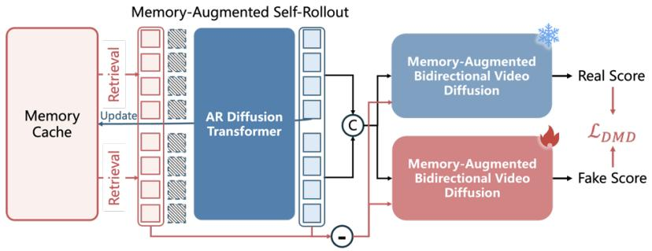  
Figure 7: Overview of context forcing. We employ memory-augmented self-rollout and memoryaugmented bidirectional video diffusion to preserve long-term consistency, enable real-time interaction, and mitigate error accumulation.

# 6.2 Context Forcing

We thus propose context forcing as shown in Fig. 7, which alleviates the memory context misalignment between teacher and student for distillation. For the student model, we self-rollout 4 chunks conditioned on the memory context $p _ { \theta } ( x _ { j : j + 3 } | x _ { 0 : j - 1 } ) = \prod _ { i = j } ^ { j + 3 } p _ { \theta } ( x _ { i } | C _ { i } )$ . To construct our teacher model $V _ { \beta }$ , we augment a standard bidirectional diffusion model with memory, and structure its context by masking $x _ { j : j + 3 }$ from student’s memory context,

$$
p _ {\text {d a t a}} \left(x _ {j: j + 3} \mid x _ {0: j - 1}\right) = p _ {\beta} \left(x _ {j: j + 3} \mid C _ {j: j + 3} - x _ {j: j + 3}\right), \tag {5}
$$

where $C _ { j : j + 3 }$ denotes all context memory chunks corresponding to student’s self-rollout $x _ { j : j + 3 }$ . By aligning the memory context with the student model, we enforce the distributions represented by the teacher to be as close as possible to the student model, which enables more effectively distribution matching. Through context forcing, we preserve long-term consistency in real-time generation with 4-denoising steps, and mitigate error accumulation. The context forcing approach eliminates the distribution mismatch that typically occurs when distilling bidirectional teachers into autoregressive students with different contextual information access patterns.

Algorithm 1 Context Forcing Training   
Require: Number of denoising timesteps $d$ and chunks $n = 4$ Require: Dataset $D$ (encoded by 3D VAE)  
Require: AR diffusion model $N_{\theta}$ Require: Bidirectional diffusion model $V_{\beta}^{face}$ and $V^{real}$ 1: loop  
2: Progressively increase maximum chunk length $m$ 3: Sample chunk length $j \sim \mathrm{Uniform}(0,1,\dots,m)$ 4: Sample context $x_{0:j-1} \sim D$ 5: for $i = j,\dots,j+n-1$ do  
6: Initialize $x_{i}^{init} \sim \mathcal{N}(0,I)$ 7: Reconstitute context memory $C_i \subseteq \{x_0,\dots,x_{i-1}\}$ 8: Sample $s \sim \mathrm{Uniform}(1,2,\dots,d)$ 9: Self-rollout $x_i$ using $N_{\theta}$ with $C_i$ and $s$ denoising steps  
10: end for  
11: Align context memory $C^{tea} \gets C_{j:j+n-1} - x_{j:j+n-1}$ 12: Sample diffusion timestep $k \sim [0,1]$ 13: $\hat{x}_{j:j+n-1} \gets \text{AddNoise}(x_{j:j+n-1},k)$ 14: Compute fake score $S^{face} \gets V_{\beta}^{face}(\hat{x}_{j:j+n-1},C^{tea},k)$ 15: Compute real score $S^{face} \gets V^{real}(\hat{x}_{j:j+n-1},C^{tea},k)$ 16: Update $\theta$ via distribution matching loss  
17: Update $\beta$ via flow matching loss as in [8]  
18: end loop

# 7 Model Inference: Play with the World

# 7.1 Acceleration and Engineering Optimization

While our distillation mechanism significantly reduces the number of denoising steps required for high-quality generation, achieving real-time streaming interaction demands additional optimizations. In this section, we describe our inference optimization pipeline that enables WorldPlay to generate high-resolution video frames with minimal latency, meeting the stringent requirements for interactive world simulation.

Mixed parallelism method for DiT and VAE. To fully leverage modern multi-GPU infrastructure, we implement sequence parallelism for both the DiT backbone and the VAE decoder across 8 GPUs. Unlike the conventional parallelism method that replicates the entire model or adapts sequence parallelism on the temporal dimension, our parallelism method combines sequence parallelism and attention parallelism, which partitions the tokens of each entire chunk across devices. This design ensures that the computational workload for generating each chunk is distributed evenly, substantially reducing per-chunk inference time while maintaining generation quality.

Streaming deployment and progressive decoding. To minimize time-to-first-frame and enable seamless interaction, we adopt a streaming deployment architecture using NVIDIA Triton Inference Framework. Rather than waiting for complete chunk generation and decoding, we implement a progressive multi-step VAE decoding strategy that decodes and streams frames in smaller batches. Upon generating latent representations from the DiT, frames are progressively decoded and immediately transmitted to the client, allowing users to observe generated content while subsequent frames are still being processed. This streaming pipeline decouples frame generation from delivery through asynchronous processing and frame buffering, ensuring smooth, low-latency interaction even under varying computational loads.

Quantization and efficient attention. To further accelerate inference while preserving generation quality, we employ a comprehensive suite of quantization strategies. Specifically, we adopt Sage Attention [34] for optimized attention computation through mixed-precision operations, apply float quantization to model weights and activations to reduce memory bandwidth requirements, and utilize matrix multiplication quantization for compute-intensive linear layers. Additionally, we use KVcache mechanisms for attention modules to eliminate redundant computations during autoregressive generation. These techniques collectively reduce memory footprint and computational cost while maintaining visual fidelity, as validated in our experiments.

Algorithm 2 Inference with KV Cache   
Require: Number of inference chunks $n_c$ Require: Denoise timesteps $\{k_1,\dots ,k_d\}$ Require: Number of inference chunks $n_c$ Require: AR diffusion model $N_{\theta}$ (returns KV embeddings via $N_{\theta}^{\mathrm{KV}}$ 1: Initialize model output $X_{\theta}\gets []$ 2: Initialize KV cache KV $\leftarrow \left[\right]$ 3: for $i = 0,\ldots ,n_c - 1$ do 4: Initialize $x_{i}\sim \mathcal{N}(0,I)$ 5: Reconstitute context memory $C_i\subseteq \{x_0,\dots ,x_{i - 1}\}$ 6: for $s = d,\ldots ,1$ do 7: if $s = d$ and $i > 1$ then 8: Reset KV $\leftarrow N_{\theta}^{\mathrm{KV}}(C_i,0)$ 9: end if 10: Denoise $x_{i}\gets N_{\theta}(x_{i},\mathbf{KV},k_{s})$ 11: end for 12: Add output $X_{\theta}$ .append $(x_{i})$ 13: end for   
14: return $X_{\theta}$

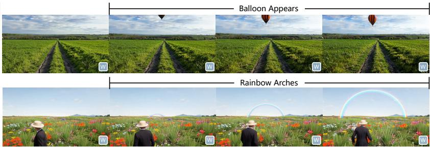  
Figure 8: Promptable events. Our method supports text-based manipulation during streaming generation, enabling users to trigger dynamic world events through natural language commands.

# 7.2 Go Beyond Action Control: Text-Based Event Triggering

Beyond navigation and exploration, HY-World 1.5 supports dynamic text-based event generation that enables users to manipulate the virtual world during streaming generation. WorldPlay supports sophisticated text-based interactions to trigger dynamic world events and modify ongoing generation streams in real-time. The promptable events support multiple categories of world simulation, including object addition and removal, environmental changes (weather, lighting), dynamics (explosions), and character behaviors (NPC actions).

As demonstrated in Fig. 8 and Fig. 1(e), users can input natural language prompts during generation to responsively alter narrative and visual content. This enables interactive storytelling, virtual environment manipulation, and dynamic content creation where users explore and modify virtual worlds through natural language interfaces.

# 8 Model Evaluation

# 8.1 Main Results

Evaluation Protocol. Our evaluation assesses both short-term generation quality and long-term geometric consistency using 600 diverse test cases from real-world videos, game recordings, and AI-generated images.

For short-term evaluation, we use test video trajectories as input poses and compare generated frames against ground truth using LPIPS, PSNR, SSIM for visual quality, plus $R _ { \mathrm { d i s t } }$ and $T _ { \mathrm { d i s t } }$ for camera pose accuracy. For long-term consistency, we design cycle trajectories where models generate frames along a path and return along the same route, comparing return path frames to initial pass frames to

Table 2: Quantitative comparisons.   
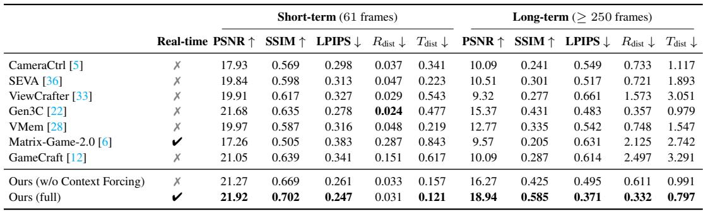

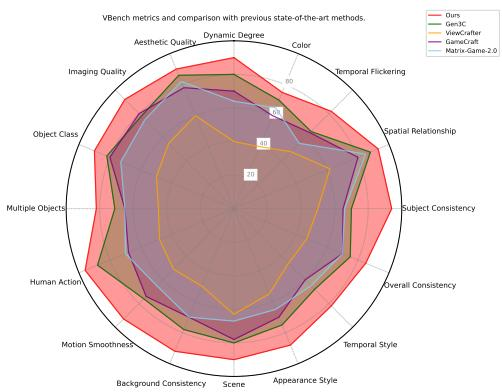  
(a) VBench evaluation.

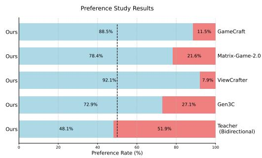  
(b) Human evaluation.   
Figure 9: Comprehensive evaluation. (a) VBench quantitative benchmarking. (b) Human evaluation results.

enforce revisiting. This directly measures geometric coherence when revisiting locations, essential for interactive experiences.

We compare against two baseline groups: (1) Action-controlled diffusion models without memory mechanisms: CameraCtrl [5], SEVA [36], ViewCrafter [33], Matrix-Game 2.0 [6], GameCraft [12]; (2) Models with memory mechanisms: Gen3C [22], VMem [14].

Quantitative Performance Analysis. Tab. 2 shows WorldPlay’s superior performance across both short-term generation quality and long-term geometric consistency. In short-term regimes, our approach achieves exceptional visual fidelity with competitive control accuracy. The gap widens in long-term scenarios where control accuracy degrades across baselines due to error accumulation. WorldPlay maintains superior stability while other methods show substantial degradation.

Fig. 9a further gives evaluation results on VBench, and Fig. 9b shows human evaluation results.

Visual Comparisons. We present qualitative comparisons against baseline methods in Fig. 10. The explicit 3D cache employed in Gen3C [22] exhibits high sensitivity to the quality of intermediate outputs and is constrained by the accuracy of depth estimation. Matrix-Game-2.0 [6] and Game-Craft [12] are unable to support free exploration, primarily due to their lack of dedicated memory mechanisms. In contrast, our reconstituted context memory ensures long-term consistency through a more robust implicit prior, thereby achieving superior scene generalizability. Additionally, other methods fail to generalize effectively to third-person scenarios—this shortcoming not only hinders the control of agents within the scene but also imposes significant limitations on their overall applicability. On the other hand, WorldPlay successfully extends its efficacy to such third-person scenarios while maintaining high visual fidelity and long-term geometric consistency.

Feedback Alignment with Reinforcement Learning. Moreover, the effectiveness of the WorldCompass RL framework is visualized in Fig. 11. The pipeline without RL training exhibits misalignment with the interaction signal and visual degradation when required to handle complex actions. In con-

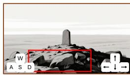

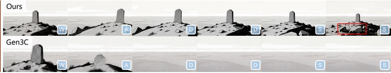

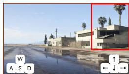

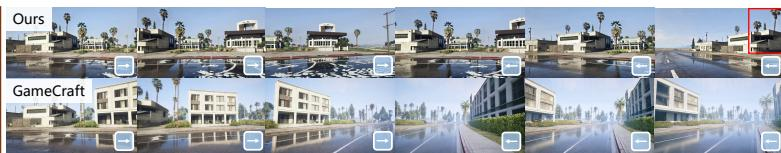

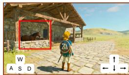

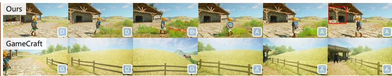

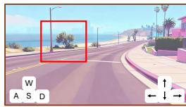

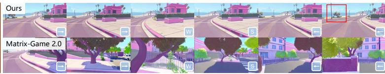

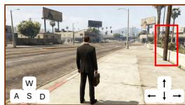

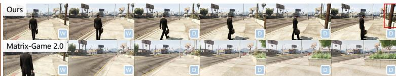  
Figure 10: Qualitative comparisons with existing methods. WorldPlay achieves the state-of-the-art long-term consistency (shown in red boxes) and visual quality across diverse scenes.

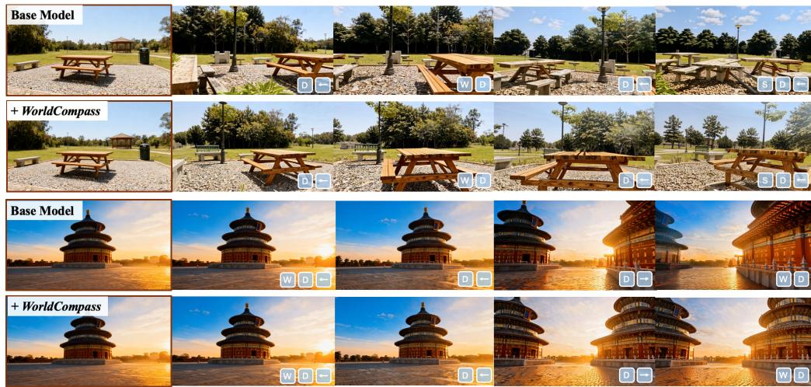  
Figure 11: Qualitative comparisons with or without the WorldCompass RL stage. The incorporation of WorldCompass RL training significantly improves the model’s ability to follow complex actions and enhances visual quality.

trast, the model after RL post-training demonstrates significantly improved action following accuracy and maintains higher visual fidelity. These substantial improvements underscore the fundamental value of post-training for world models and highlight the potential of our robust and efficient World-Compass RL framework to elevate the core capabilities of world models in complex, long-horizon interactive scenarios.

Ablation Studies. Detailed analysis on Action Representation Design, Memory Design, and Context Forcing Design, and Reinforcement Learning Design can be found in WorldPlay [24] and WorldCompass [27].

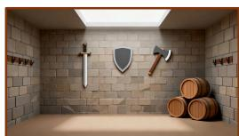

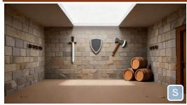

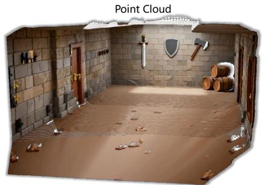

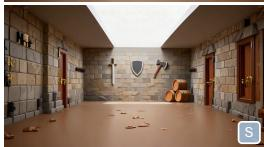

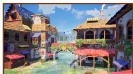

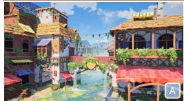

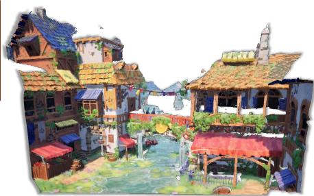

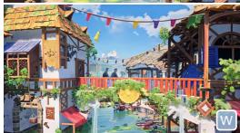  
Figure 12: 3D reconstruction results with WorldPlay and WorldMirror.

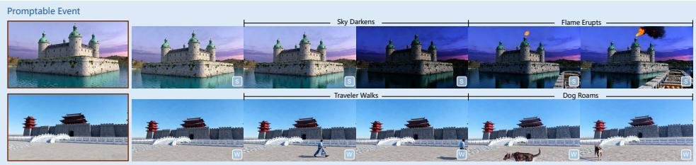

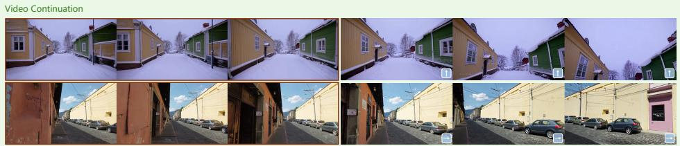  
Figure 13: Visualization of promptable event and video continuation.

# 8.2 Applications and More Results

Application on 3D Scene Reconstruction. Our reconstituted context memory ensures exceptional long-term geometric consistency, enabling seamless integration with 3D reconstruction systems for high-quality point clouds and scene representations. As shown in Fig. 12, the model generates consistent multi-view observations serving as excellent input for reconstruction pipelines like World-Mirror [19]. Geometric coherence during generation significantly reduces artifacts and improves reconstruction quality compared to inconsistent video approaches.

Application on Dynamic Event Manipulation. WorldPlay supports sophisticated text-based interactions to trigger dynamic world events and modify ongoing generation streams in real-time. As shown in the upper part of Fig. 13, we can change the weather and trigger a fire eruption, or introduce new objects and characters. Through promptable events, we can generate various complex and uncommon scenarios, which can benefit agent learning by enabling agents to handle these unexpected situations.

Application on Video Continuation. As shown at the bottom of Fig. 13, WorldPlay can generate follow-up content that remains highly consistent with a given initial video clip in terms of motion, appearance, and lighting. This enables stable video continuation, effectively extending the original

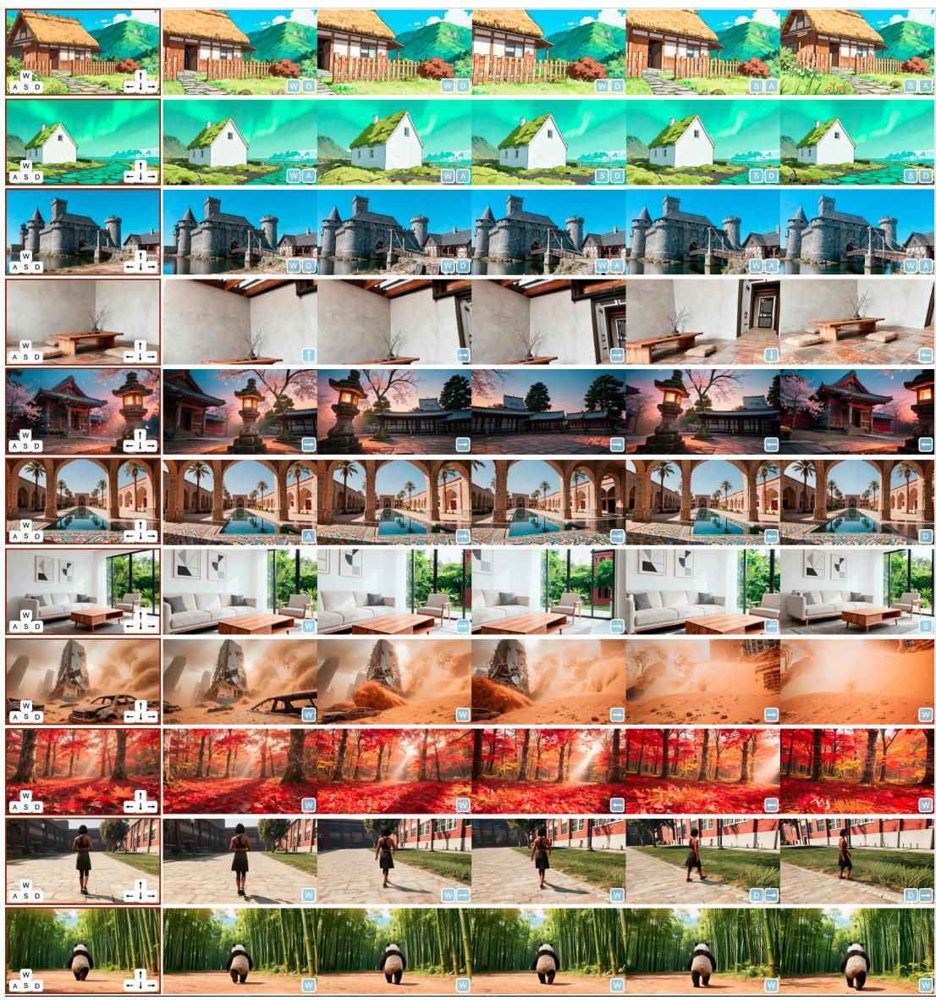  
Figure 14: More qualitative results.

video while preserving spatial-temporal consistency and content coherence, which opens up new possibilities in creative video generation and virtual environment construction.

More Visualization. Fig. 14 shows more results of our model. Fig. 15 presents long video generation results with geometric consistency.

# 9 Conclusion

This work presents a comprehensive framework HY-World 1.5 for interactive world modeling that achieves both real-time latency and geometric consistency. HY-World 1.5 draws power from our autoregressive generation model WorldPlay and reinforcement learning method WorldCompass. It empowers users to customize unique worlds from a single image or text prompt. While focused on navigation control, its architecture has shown potential for richer interaction, like dynamic and text-triggered events. By providing a systematic framework for control, memory, and distillation, the proposed method marks a critical step toward creating consistent and interactive virtual worlds. Extending it to generate longer videos with multi-agent interaction and complex physical dynamics would be a fruitful future direction.

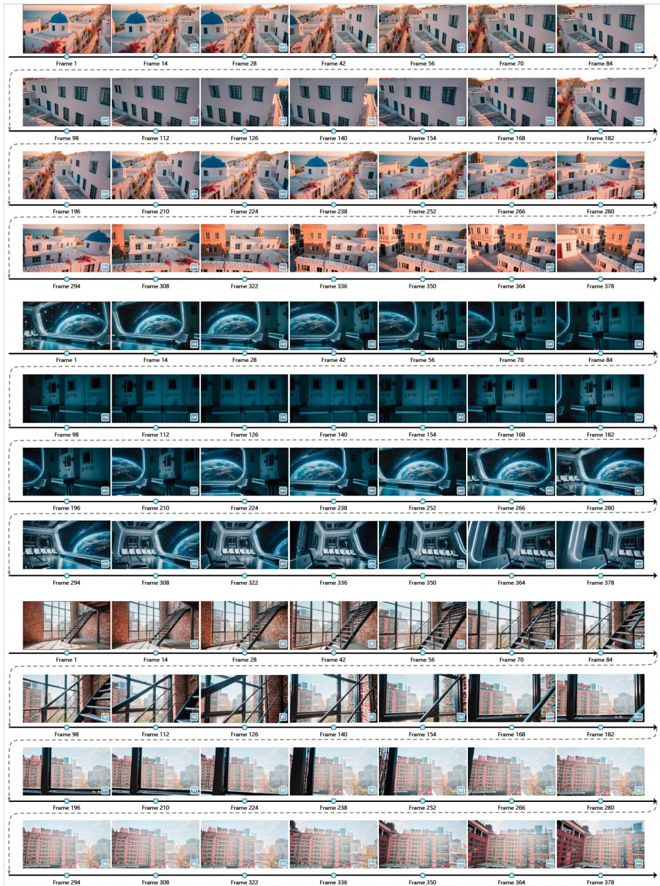  
Figure 15: Long video generation.

# Contributors

• Project Sponsors: Jie Jiang, Linus, Yuhong Liu, Di Wang, Peng Chen   
• Project Leaders: Chunchao Guo, Tengfei Wang   
• Core Contributors: Haiyu Zhang, Wenqiang Sun, Haoyuan Wang, Zehan Wang, Junta Wu, Zhenwei Wang, Xuhui Zuo, Chenjie Cao   
• Contributors (Listed alphabetically): Coopers Li, Guojian Xiao, Hao Zhang, Jiaxin Lin, Jianchen Zhu, Jie Xiao, Lei Wang, Lifu Wang, Lin Niu, Minghui Chen, Peng He, Runzhou Wu, Sicong Liu, Tianyu Huang, Wangchen Qin, Wencong Lin, Xiang Yuan, Xinyang Li, Yifu Sun, Yifei Tang, Yihang Lian, Yonghao Tan, Zhan Li

# References

[1] Haoxuan Che, Xuanhua He, Quande Liu, Cheng Jin, and Hao Chen. Gamegen-x: Interactive open-world game video generation. arXiv preprint arXiv:2411.00769, 2024.   
[2] Boyuan Chen, Diego Martí Monsó, Yilun Du, Max Simchowitz, Russ Tedrake, and Vincent Sitzmann. Diffusion forcing: Next-token prediction meets full-sequence diffusion. Advances in Neural Information Processing Systems, 37:24081–24125, 2024.   
[3] Justin Cui, Jie Wu, Ming Li, Tao Yang, Xiaojie Li, Rui Wang, Andrew Bai, Yuanhao Ban, and Cho-Jui Hsieh. Self-forcing $^ { + + }$ : Towards minute-scale high-quality video generation. arXiv preprint arXiv:2510.02283, 2025.   
[4] Etched Decart. Oasis: A universe in a transformer. https://oasis-model.github.io/, 2024.   
[5] Hao He, Yinghao Xu, Yuwei Guo, Gordon Wetzstein, Bo Dai, Hongsheng Li, and Ceyuan Yang. Cameractrl: Enabling camera control for text-to-video generation. In ICLR, 2025.   
[6] Xianglong He, Chunli Peng, Zexiang Liu, Boyang Wang, Yifan Zhang, Qi Cui, Fei Kang, Biao Jiang, Mengyin An, Yangyang Ren, et al. Matrix-game 2.0: An open-source, real-time, and streaming interactive world model. arXiv preprint arXiv:2508.13009, 2025.   
[7] Jiahui Huang, Qunjie Zhou, Hesam Rabeti, Aleksandr Korovko, Huan Ling, Xuanchi Ren, Tianchang Shen, Jun Gao, Dmitry Slepichev, Chen-Hsuan Lin, et al. Vipe: Video pose engine for 3d geometric perception. arXiv preprint arXiv:2508.10934, 2025.   
[8] Xun Huang, Zhengqi Li, Guande He, Mingyuan Zhou, and Eli Shechtman. Self forcing: Bridging the train-test gap in autoregressive video diffusion. arXiv preprint arXiv:2506.08009, 2025.   
[9] Team HunyuanWorld. Hunyuanworld 1.0: Generating immersive, explorable, and interactive 3d worlds from words or pixels. arXiv preprint, 2025.   
[10] Bernhard Kerbl, Georgios Kopanas, Thomas Leimkühler, and George Drettakis. 3d gaussian splatting for real-time radiance field rendering. ACM Trans. Graph., 42(4):139–1, 2023.   
[11] Diederik P Kingma and Max Welling. Auto-encoding variational bayes. arXiv preprint arXiv:1312.6114, 2013.   
[12] Jiaqi Li, Junshu Tang, Zhiyong Xu, Longhuang Wu, Yuan Zhou, Shuai Shao, Tianbao Yu, Zhiguo Cao, and Qinglin Lu. Hunyuan-gamecraft: High-dynamic interactive game video generation with hybrid history condition. arXiv preprint arXiv:2506.17201, 2025.   
[13] Ruilong Li, Brent Yi, Junchen Liu, Hang Gao, Yi Ma, and Angjoo Kanazawa. Cameras as relative positional encoding. arXiv preprint arXiv:2507.10496, 2025.   
[14] Runjia Li, Philip Torr, Andrea Vedaldi, and Tomas Jakab. Vmem: Consistent interactive video scene generation with surfel-indexed view memory. In ICCV, 2025.   
[15] Zhen Li, Chuanhao Li, Xiaofeng Mao, Shaoheng Lin, Ming Li, Shitian Zhao, Zhaopan Xu, Xinyue Li, Yukang Feng, Jianwen Sun, et al. Sekai: A video dataset towards world exploration. arXiv preprint arXiv:2506.15675, 2025.   
[16] Lu Ling, Yichen Sheng, Zhi Tu, Wentian Zhao, Cheng Xin, Kun Wan, Lantao Yu, Qianyu Guo, Zixun Yu, Yawen Lu, et al. Dl3dv-10k: A large-scale scene dataset for deep learning-based 3d vision. In CVPR, pages 22160–22169, 2024.   
[17] Yaron Lipman, Ricky TQ Chen, Heli Ben-Hamu, Maximilian Nickel, and Matt Le. Flow matching for generative modeling. In ICLR, 2023.   
[18] Kunhao Liu, Wenbo Hu, Jiale Xu, Ying Shan, and Shijian Lu. Rolling forcing: Autoregressive long video diffusion in real time. arXiv preprint arXiv:2509.25161, 2025.   
[19] Yifan Liu, Zhiyuan Min, Zhenwei Wang, Junta Wu, Tengfei Wang, Yixuan Yuan, Yawei Luo, and Chunchao Guo. Worldmirror: Universal 3d world reconstruction with any-prior prompting. arXiv preprint arXiv:2510.10726, 2025.

[20] Jack Parker-Holder, Philip Ball, Jake Bruce, Vibhavari Dasagi, Kristian Holsheimer, Christos Kaplanis, Alexandre Moufarek, Guy Scully, Jeremy Shar, Jimmy Shi, Stephen Spencer, Jessica Yung, Michael Dennis, Sultan Kenjeyev, Shangbang Long, Vlad Mnih, Harris Chan, Maxime Gazeau, Bonnie Li, Fabio Pardo, Luyu Wang, Lei Zhang, Frederic Besse, Tim Harley, Anna Mitenkova, Jane Wang, Jeff Clune, Demis Hassabis, Raia Hadsell, Adrian Bolton, Satinder Singh, and Tim Rocktäschel. Genie 2: A large-scale foundation world model. 2024.   
[21] William Peebles and Saining Xie. Scalable diffusion models with transformers. In ICCV, pages 4195–4205, 2023.   
[22] Xuanchi Ren, Tianchang Shen, Jiahui Huang, Huan Ling, Yifan Lu, Merlin Nimier-David, Thomas Müller, Alexander Keller, Sanja Fidler, and Jun Gao. Gen3c: 3d-informed world-consistent video generation with precise camera control. In CVPR, pages 6121–6132, 2025.   
[23] Jianlin Su, Murtadha Ahmed, Yu Lu, Shengfeng Pan, Wen Bo, and Yunfeng Liu. Roformer: Enhanced transformer with rotary position embedding. Neurocomputing, 568:127063, 2024.   
[24] Wenqiang Sun, Haiyu Zhang, Haoyuan Wang, Junta Wu, Zehan Wang, Zhenwei Wang, Yunhong Wang, Jun Zhang, Tengfei Wang, and Chunchao Guo. Worldplay: Towards long-term geometric consistency for real-time interactive world model. arXiv preprint, 2025.   
[25] Tencent Hunyuan Foundation Model Team. Hunyuanvideo 1.5 technical report, 2025.   
[26] Team Wan, Ang Wang, Baole Ai, Bin Wen, Chaojie Mao, Chen-Wei Xie, Di Chen, Feiwu Yu, Haiming Zhao, Jianxiao Yang, et al. Wan: Open and advanced large-scale video generative models. arXiv preprint arXiv:2503.20314, 2025.   
[27] Zehan Wang, Tengfei Wang, Haiyu Zhang, Wenqiang Sun, Junta Wu, Haoyuan Wang, Zhenwei Wang, Hengshuang Zhao, Chunchao Guo, and Zhou Zhao. Worldcompass: Reinforcement learning for longhorizon world models. 2025.   
[28] Zhouxia Wang, Ziyang Yuan, Xintao Wang, Yaowei Li, Tianshui Chen, Menghan Xia, Ping Luo, and Ying Shan. Motionctrl: A unified and flexible motion controller for video generation. In ACM SIGGRAPH, pages 1–11, 2024.   
[29] Zeqi Xiao, Yushi Lan, Yifan Zhou, Wenqi Ouyang, Shuai Yang, Yanhong Zeng, and Xingang Pan. Worldmem: Long-term consistent world simulation with memory. arXiv preprint arXiv:2504.12369, 2025.   
[30] Shuai Yang, Wei Huang, Ruihang Chu, Yicheng Xiao, Yuyang Zhao, Xianbang Wang, Muyang Li, Enze Xie, Yingcong Chen, Yao Lu, et al. Longlive: Real-time interactive long video generation. arXiv preprint arXiv:2509.22622, 2025.   
[31] Tianwei Yin, Michaël Gharbi, Taesung Park, Richard Zhang, Eli Shechtman, Fredo Durand, and Bill Freeman. Improved distribution matching distillation for fast image synthesis. Advances in neural information processing systems, 37:47455–47487, 2024.   
[32] Jiwen Yu, Jianhong Bai, Yiran Qin, Quande Liu, Xintao Wang, Pengfei Wan, Di Zhang, and Xihui Liu. Context as memory: Scene-consistent interactive long video generation with memory retrieval. arXiv preprint arXiv:2506.03141, 2025.   
[33] Wangbo Yu, Jinbo Xing, Li Yuan, Wenbo Hu, Xiaoyu Li, Zhipeng Huang, Xiangjun Gao, Tien-Tsin Wong, Ying Shan, and Yonghong Tian. Viewcrafter: Taming video diffusion models for high-fidelity novel view synthesis. arXiv preprint arXiv:2409.02048, 2024.   
[34] Jintao Zhang, Jia Wei, Pengle Zhang, Jun Zhu, and Jianfei Chen. Sageattention: Accurate 8-bit attention for plug-and-play inference acceleration. In ICLR, 2025.   
[35] Kaiwen Zheng, Huayu Chen, Haotian Ye, Haoxiang Wang, Qinsheng Zhang, Kai Jiang, Hang Su, Stefano Ermon, Jun Zhu, and Ming-Yu Liu. Diffusionnft: Online diffusion reinforcement with forward process. 2025.   
[36] Jensen Zhou, Hang Gao, Vikram Voleti, Aaryaman Vasishta, Chun-Han Yao, Mark Boss, Philip Torr, Christian Rupprecht, and Varun Jampani. Stable virtual camera: Generative view synthesis with diffusion models. arXiv preprint arXiv:2503.14489, 2025.